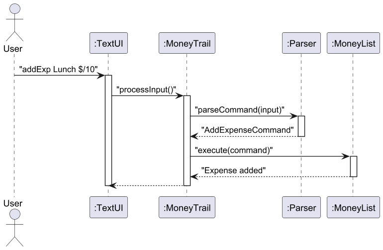
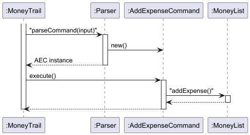
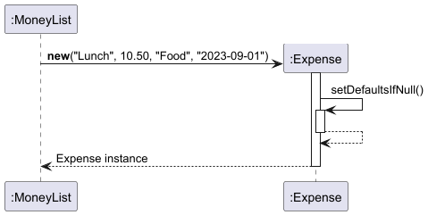
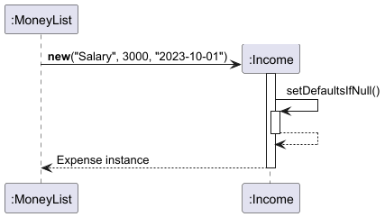
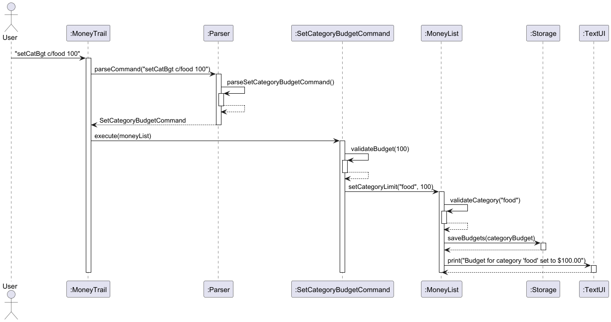
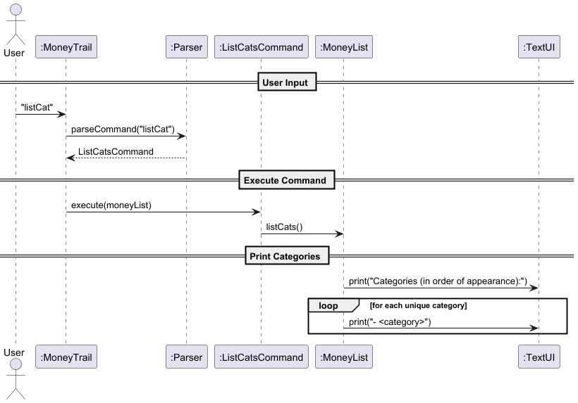
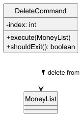
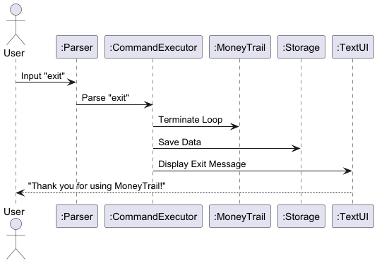

# Developer Guide

[1. Acknowledgements](#1-acknowledgements) <br>
[2. Design](#2-design) <br>
[3. Implementations](#3-implementations) <br>
[4. Product Scope](#4-product-scope) <br>
[5. User Stories](#5-user-stories) <br>
[6. Non-Functional Requirements](#6-non-functional-req) <br>
[7. Glossary](#7-glossary) <br>
[8. Instructions for Manual Testing](#8-testing) <br>

## Acknowledgements <a name="1-acknowledgements"></a>

{NONE AT THE MOMENT}

## Design <a name="2-design"></a>

> [!TIP]
> Tip: The `.puml` files used to create diagrams in this document `docs/diagrams` folder.

### Architecture Overview


The **Architecture Diagram** given above explains the high-level design of the App.

Below is an overview of the main components and their interactions with one another:

The application is divided into several classes, each with a specific responsibility:
- `MoneyTrail`: The **main** class that initializes the application and handles user input.
- `MoneyList`: Manages the list of expenses and provides methods for adding, deleting, listing, and finding expenses.
- `Storage`: Handles loading and saving data to a file.
- `TextUI`: Manages user interface interactions, such as displaying messages and errors.
- `MTLogger`: Logs application events and errors for debugging and monitoring (Will not be discussed).
- `MTException`: A custom exception class for handling application-specific errors.
- `Expense`: Represents an expense entry with a description and amount.
- `Income`: Represents an income entry with a description, amount, date, and provides a formatted string for display.
- `Parser`: Processes user input and converts it into the corresponding Command object.
- `Command`: Defines a common interface for all operations that can be executed in the application.

### MoneyTrail Component: `MoneyTrail.java`

**Role**: Entry point and main controller of the application.

Here is the UML component diagram of `MoneyTrail.java`:


This UML component diagram illustrates `MoneyTrail.java`’s role 
as the central coordinator in the architecture:

- MoneyTrail (shown as a composite component) receives user input via TextUI and delegates parsing to the Parser.


- It forwards parsed commands to MoneyList for execution, which interacts with Storage to persist data.


- Simplifications: Logging and error-handling components are omitted to focus on core data flow.

Here is the UML sequence diagram of `MoneyTrail.java` touching only its main loop:



This UML sequence diagram captures the simplified command execution flow:

- The User submits an expense command (e.g., addExp Lunch $/10) through TextUI.


- MoneyTrail triggers parsing via Parser, which returns a concrete AddExpenseCommand.


- The command is executed by MoneyList, with results relayed back to TextUI.


- Simplifications: Uses pseudocode (processInput()) instead of exact method names.


- Key omission: Loop logic and error handling are excluded to highlight the happy path.

Here is the Java Code snippet showing the core loop:

```
public void run() {
  // ...
  while (!shouldExit) {
    String input = in.nextLine().trim();          // User input
    Command command = parser.parseCommand(input); // Delegates parsing
    command.execute(moneyList);                  // Delegates execution
  }
}
```

The provided Java snippet:

- Continuously reads user input (in.nextLine()).


- Delegates parsing to Parser and execution to MoneyList via the Command pattern.


- Focus: Demonstrates the class’s role as a facade without exposing internal details like logging.

### Text UI Component: `TextUI.java`

**Role**: Handles all user interactions and visual output for the MoneyTrail application.

Here is the UML class diagram of `TextUI.java`:


The simplified UML class diagram shows TextUI's core structure:

- Focuses on key public methods like print() and showAllAvailableCommands()


- Explicitly omits internal helpers (noted in comment)

Here is the UML sequence diagram of `TextUI.java`:


This UML sequence diagram demonstrates a typical command flow:

- User requests "help" via MoneyTrail


- TextUI activates to display command list


- Shows clean activation/deactivation lifecycle


- Simplified to one representative interaction and omits lower-level print operations

### Parser Component: `Parser.java`

**Role**:

- Translates raw user input into executable Command objects

- Validates input syntax

- Handles parsing errors with meaningful feedback

Here is the UML class diagram of `Parser.java`:

> [!NOTE]
> This class diagram only concerns parsing the command that adds expense entries.


This simplified UML class diagram shows the Parser's core structure:

- The Parser class depends on the Command interface to produce concrete command objects like AddExpenseCommand.


- Key methods like parseCommand() and factory methods (e.g., createAddExpenseCommand()) are highlighted, while internal helpers are omitted for clarity.

Here is the UML sequence diagram of `Parser.java`:


This UML sequence diagram illustrates the parsing workflow for an "add expense" command:

- User input flows from MoneyTrail to the Parser, which activates to process the request.


- The Parser delegates to specialized factory methods to instantiate a concrete AddExpenseCommand.

Here are the core Java Code snippets:

```
public Command parseCommand(String input) throws MTException {
  if (input.trim().isEmpty()) {
    throw new MTException("Empty command");  // Input validation
  }
  return createCommandFromInput(input);      // Delegation
}
```

This method demonstrates the Parser's two key responsibilities:

- Input validation (rejecting empty strings).


- Delegation to command-specific factory methods.

```
private Command createAddExpenseCommand(String input) throws MTException {
  // Simplified extraction:
  String[] parts = input.split("\\$/"); 
  double amount = Double.parseDouble(parts[1].split(" ")[0]);
  return new AddExpenseCommand(...);
}
```

This method shows simplified parsing logic for expense commands:

- Splits input to extract amount and description.


- Constructs a ready-to-execute AddExpenseCommand object.

### Money List Component: `MoneyList.java`

**Role**:

- Core data manager for all financial entries (expenses/incomes)

- Central hub for business logic operations

- Bridge between commands and storage

Here is the simplified UML class diagram of `MoneyList.java`:


This simplified UML diagram shows MoneyList's core structure:

- Manages an ArrayList of financial entries


- Collaborates with Storage (persistence) and TextUI (display)

Here is the UML sequence diagram of `MoneyList.java`:


This UML sequence diagram:

- Illustrates the addExpense workflow with activation bars:


- User command flows through Parser to MoneyList


- MoneyList validates input (nested activation)


- Saves via Storage and confirms via TextUI

Here are the Java Code snippets:

```
public void addExpense(String input) throws MTException {
  // Input parsing omitted
  Expense newExp = new Expense(desc, amount, cat, date);
  moneyList.add(newExp.toString());  // Store formatted string
  storage.saveEntries(moneyList);    // Persist
  ui.print("Added: " + newExp);     // Confirm
}
```

This snippet demonstrates three key responsibilities:

- Creates Expense object from parsed data


- Updates in-memory list


- Coordinates persistence and user feedback


- Shows clean separation of concerns

```
public void loadEntriesFromFile() throws MTException {
  moneyList.clear();
  moneyList.addAll(storage.loadEntries());  // Delegates IO
  logger.logInfo("Loaded " + moneyList.size() + " entries"); 
}
```

This snippet highlights storage integration:

- Clears current state


- Delegates file operations to Storage


- Logs results


- Emphasizes single responsibility principle

### Storage Component: `Storage.java`

**Role**: Handles all file I/O operations for persistent data storage, including:

- Saving entries to mt.txt

- Loading entries on startup

- Encapsulating filesystem interactions

Here is the UML class diagram of `Storage.java`:


This UML class diagram shows the Storage component's structure and its relationship with MoneyList:

- saveEntries() and loadEntries() define the file I/O interface.


- MoneyList depends on Storage for persistence but remains decoupled from file operations.


- Key Omissions: Internal helper methods and low-level file handling details are excluded for clarity.

Here is the UML sequence diagram of `Storage.java`:


**Warning**: Due to unexplained image exportation issues, some activation bars will have missing lines at the top.
The original `.puml` files have complete activation bars.

This UML sequence diagram illustrates the file read/write workflow:

1. Loading Data:

- MoneyList activates Storage to load entries, which reads mt.txt before returning parsed data.

2. Saving Data:

- MoneyList triggers a save, with Storage writing all entries atomically.

### Command Component: `Command.java`

**Role**:

The Command interface defines the execution contract for all user actions in MoneyTrail, enabling:

- Uniform execution of diverse operations (add, delete, search)

- Decoupled control flow between parsing and execution

- Termination control for session management

Here is a simplified UML class diagram:


This class diagram:

- shows that all concrete commands implement the Command interface.


- simplifications: Only 4 representative commands shown (others follow same pattern) and method details omitted except interface signature.

Here is the UML sequence diagram that outlines the functionality of adding an expense entry:



This sequence diagram illustrates:

- The MoneyTrail component receives parsed AddExpenseCommand from the Parser.

- The command's execute() method activates to modify the MoneyList.

Here are the self-explanatory Java code snippets:

```
public interface Command {
    /**
     * @param moneyList Target list for modifications
     * @throws MTException On execution failures
     */
    void execute(MoneyList moneyList) throws MTException;

    /** @return true triggers application exit */
    boolean shouldExit();
}
```

```
class ExitCommand implements Command {
    @Override
    public void execute(MoneyList moneyList) {
        // No operation required
    }

    @Override
    public boolean shouldExit() {
        return true; // Signals termination
    }
}
```

### Expense Component: `Expense.java`

**Role**:

Models financial expenditure entries with:

- Description

- Amount

- Category (default: "Uncategorized")

- Date (default: "no date")

Here is a self-explanatory UML class diagram:


`Expense.java`'s toString() method prints out the string representation of an expense entry.
Stored expense entries also used this string format.

Here is a simplified UML sequence diagram:



This sequence diagram shows the end-to-end process of instantiating an Expense object:

- MoneyList initiates the creation by calling Expense's constructor with parameters ("Lunch", 10.50, etc.), shown by its activation bar spanning the entire operation.


- The Expense object activates during its initialization phase to handle default value assignment (like auto-setting "Uncategorized" for null categories).


- Control returns to MoneyList with the fully constructed Expense instance.

Here is a Java code snippet and its sample output:

```
// Creating and storing an expense
Expense lunch = new Expense("Lunch", 12.50, "Food", null);
moneyList.add(lunch.toString());  // Stores formatted string
```

Outcome:
```
"Expense: Lunch $12.50 {Food} [no date]"
```

### Income Component: `Income.java`

**Role**:

Models financial income entries with::

- Description (required)

- Amount (positive value)

- Date (default: "no date")

Here is a self-explanatory UML class diagram:


Here is a simplified UML sequence diagram:



The sequence diagram of `Income.java` shares the same underlying 
explanations as the sequence diagram of `Expense.java`.

Here is a self-explanatory Java code snippet and its sample output:

```
Income salary = new Income("Salary", 3000.00, null);
moneyList.add(salary.toString()); 
```

Outcome:
```
"Income: Salary $3000.00 [no date]"
```

## Implementations <a name="3-implementations"></a>

This section describes some details on how certain features are implemented.

## SetCategoryBudgetCommand & BudgetCommand Features

**Overview**:

The `SetCategoryBudgetCommand` sets a budget limit for a specific expense category:

- Parameter Parsing: Extracts category and amount from command input.

- Validation: Ensures amount is numeric and non-negative; category is not empty. 

- Persistence: Updates the stored category budgets via Storage.

**Implementation**: Encapsulates logic to update category-level budgets while complying with the Command interface.

**Workflow**:



**Why this design**:

- Modular Parsing: Parser delegates creation of the command, isolating input handling.

- Encapsulation: Category logic lives in MoneyList, not the command class.

- Separation of Concerns: Each class (Parser, Command, MoneyList) handles its own role clearly.

- Persistence: Ensures budget updates are immediately saved to file.

**Key Code Snippets**:

```
// In Parser.java
String[] parts = trimmed.split("\\s+", 2);
String category = parts[0].substring(2).trim(); // removes "c/"
double amount = Double.parseDouble(parts[1].trim());
return new SetCategoryBudgetCommand(category, amount);
```

Rationale: Efficiently splits user input, ensures valid category and parses numeric budget.

```
// In SetCategoryBudgetCommand.java
public void execute(MoneyList moneyList) throws MTException {
    moneyList.setCategoryLimit(category, amount);
}
```

Rationale: Clean delegation to MoneyList, which handles validation, storage, and UI feedback.

## ListCatsCommand & ListCommand Features

**Overview**:

The `ListCatsCommand` displays all unique categories used in existing expense entries:

**Key Characteristics**:

- Extraction Logic: Parses categories from string-formatted expense entries.

- User Feedback: Provides friendly output listing categories in order of appearance.

- Robustness: Handles empty lists and malformed entries gracefully.

Implementation: Implements the Command interface and delegates logic to MoneyList.listCats().



**Why this design**:

- Separation of Concerns: Parsing stays in Parser, business logic in MoneyList, and output in TextUI.

- User Experience: Avoids duplicate category names and maintains intuitive display order.

- Defensive Programming: Safeguards against null entries or missing {} in expense strings.

**Key Code Snippets**:

```
@Override
public void execute(MoneyList moneyList) {
    moneyList.listCats();
}
```

Rationale: Simple delegation to the domain class, keeps command class clean and focused.

```
// In MoneyList.listCats()
for (String entry : moneyList) {
    String beforeCat = entry.substring(entry.indexOf("{") + 1).trim();
    String category = beforeCat.split("}", 2)[0];
    categories.add(category);
}
```

Rationale: Extracts category from each entry while preserving insertion order using a LinkedHashSet.

## EditExpenseCommand

**Overview**:

The `EditExpenseCommand` updates the details of an existing expense entry, such as description, amount, category, or date.

**Key characteristics**:

- 1-based index: User input is converted to 0-based internally.

- Partial Updates: Supports optional editing — any missing field retains its old value.

- Validation: Checks for proper format, entry type, and valid index.

- Persistence: Saves changes immediately to storage.

**Implementation**: Implements the Command interface and delegates modification logic to MoneyList.editExpense(...).

**Workflow**:


**Why this design**:

- Flexible Parsing: Parser extracts only the fields that were included by the user.

- Robust Update Logic: MoneyList handles the safe merging of old and new fields.

- Defensive Programming: Prevents editing non-expense entries or malformed lines.

- Persistence Guarantee: Changes are saved immediately to prevent data loss.

**Key Code Snippets**:

```
// In EditExpenseCommand
public void execute(MoneyList moneyList) throws MTException {
    moneyList.editExpense(index, newDescription, newAmount, newCategory, newDate);
}
```

Rationale: Simple execution method defers logic to the MoneyList class for clarity and separation of concerns.

```
// In MoneyList.editExpense()
if (newDesc == null || newDesc.isEmpty()) {
    newDesc = oldDescription;
}
if (newAmount <= 0.00) {
    newAmount = oldAmount;
}
```

Rationale: Ensures that missing fields are safely defaulted to their existing values, enabling partial updates.

## FindCommand Feature

**Overview**:

The `FindCommand` searches for entries in the MoneyList that contain a specific keyword, case-insensitively.

- Search Scope: Scans all entries (expenses and incomes) as raw strings.

- Case-Insensitive: Matches regardless of capitalization.

- Feedback: Notifies user of matched results or when none are found.

**Implementation**: Implements the Command interface and delegates search logic to MoneyList.findEntry(keyword).

**Workflow**:


**Why this design**:

- Simple Matching: Leverages String.contains() and lowercasing for intuitive matching.

- Feedback-Oriented: Tells user what was found or if no match exists.

- Robust Edge Handling: Gracefully handles null/empty inputs and missing matches.

**Key Code Snippets**:

```
// In Parser.java
String keyword = input.substring(5).trim();
return new FindCommand(keyword);
```

Rationale: Efficiently strips the find prefix and trims whitespace, ensuring the keyword is clean and valid.

```
// In MoneyList.findEntry()
for (String entry : moneyList) {
    if (entry.toLowerCase().contains(input.toLowerCase())) {
        results.add(entry);
    }
}
```

Rationale: Performs a basic case-insensitive search over all stored entries and collects results.

## DeleteCommand Feature

**Overview**:

The `DeleteCommand` permanently removes an entry from MoneyList based on user-specified index. 
Key characteristics:

- 1-based indexing (user-facing) converted to 0-based (internal)

- Validation: Checks for invalid indices before deletion

- Data Persistence: Automatically saves changes to storage



Implementation: Encapsulates deletion logic while adhering to the Command interface.

**Workflow**:


**Why this design**:

- Separation of Concerns: Parsing vs execution

- Validation: MoneyList handles index bounds checking

- Persistence: Storage updated immediately after deletion

**Key Code Snippets**:

```
// In DeleteCommand constructor
this.index = Integer.parseInt(input.replaceAll("[^0-9]", "")) - 1;
```

Rationale: Translates user's 1-based input to 0-based list indexing while sanitizing non-numeric characters.

```
public void execute(MoneyList moneyList) throws MTException {
    String deleteCommand = "delete " + (index + 1); // Reconstruct user command
    moneyList.deleteEntry(deleteCommand); // Delegates to MoneyList
}
```

Why: Reuses existing MoneyList logic while maintaining consistent command formatting.

## Exit Feature

**Overview**:

The ExitCommand provides a controlled shutdown of MoneyTrail by:

- Terminating the main processing loop

- Triggering a final data save

- Displaying a farewell message

**Key Characteristics**:

- Immediate persistence before exit

- No return to command loop

- Minimal dependencies

**Workflow**:


Why: Clearly separates success/failure paths while showing system state changes.



Key Interactions:

- Parser active only during initial parsing

- ExitCommand handles shutdown sequence

- Storage activates briefly for final save

**Key Code Snippets**:

`ExitCommand.java`:

```
public class ExitCommand implements Command {
    @Override
    public void execute(MoneyList moneyList) {
        // No operations needed beyond flagging exit
    }

    @Override
    public boolean shouldExit() {
        return true; // Critical termination flag
    }
}
```

Design Choice: Minimalist implementation since persistence is handled by MoneyTrail's main loop cleanup.

`MoneyTrail.java` (snippet):

```
while (!shouldExit) {
    Command cmd = parser.parseCommand(input);
    cmd.execute(moneyList); // Triggers save if ExitCommand
    shouldExit = cmd.shouldExit(); // Loop control
}
```

Why: Centralizes shutdown logic in the main loop for consistency.

**Design Rationale**:

1. Safety:

- Final save occurs even if user force-quits

- Atomic shouldExit flag prevents partial shutdown

2. User Experience:

- Clear exit confirmation message

- No hidden background processes

3. Extensibility:

- Easy to add pre-exit hooks (e.g., analytics logging)

## Product scope <a name="4-product-scope"></a>

### Target user profile

Tertiary students who:
- Are budget-conscious and want to track their spending
- Find it troublesome to log their expenses and income on pen and paper.
- Want a lightweight, fast, and offline personal finance tracker
- Appreciate having flexibility to edit, categorize, and budget their expenses and income

### Value proposition

"Track expenses, manage budgets, and control 
spending—all in one simple CLI app for personal 
finance mastery."

## User Stories <a name="5-user-stories"></a>

| Version | As a ... | I want to ...                                                  | So that I can ...                                            |
|---------|----------|----------------------------------------------------------------|--------------------------------------------------------------|
| v1.0    | new user | see usage instructions                                         | refer to them when I forget how to use the application       |
| v1.0    | user     | view all expense entries                                       | review my recorded expenses                                  |
| v1.0    | user     | delete an expense entry                                        | remove entries I no longer need                              |
| v1.0    | user     | set a total budget limit                                       | monitor my expenses within a predefined limit                |
| v1.0    | user     | see the sum of all my expenses                                 | understand my total spending                                 |
| v2.0    | user     | add new expense with a description, amount, category, and date | keep track of my spending efficiently                        |
| v2.0    | user     | find an entry by name                                          | locate an entry without having to go through the entire list |
| v2.0    | user     | edit entries                                                   | update incorrect or outdated entries                         |
| v2.0    | user     | list all used categories                                       | analyze spending patterns across different categories        |
| v2.0    | user     | clear all entries                                              | reset the application entirely                               |

## Non-Functional Requirements <a name="6-non-functional-req"></a>

#### Usability

#### User-friendly Interface:
The application should have an intuitive design, making it easy for users to navigate and input data.

#### Error Feedback
Provide clear and actionable feedback when a user makes a mistake (e.g., invalid input format).

### Performance

#### Fast Response Time:
The application should process commands and display results within a fraction of a second
to ensure a smooth user experience

### Reliability

#### Error Recovery
The application should gracefully handle unexpected crashes or errors, saving user data wherever possible.

#### Accuracy
Calculations (e.g., total expenses, budget limits) must be precise and error-free.

## Glossary <a name="7-glossary"></a>

| Term           | Definition                                                                                         | 
|----------------|----------------------------------------------------------------------------------------------------|
| Expense Entry  | A record in the application that captures the description, amount, category, and date of spending. |
| Category       | A label used to group similar expenses, such as Food, Transportation, or Entertainment.            |
| Index          | A number assigned to each entry in the list for easy identification and management.                |
| Budget         | A predefined limit set by the user to control and monitor overall spending.                        |
| Total Expenses | The sum of all recorded expenses, used to understand total spending.                               |
| Command        | A specific instruction given to the application to perform an action, such as addExp or del.       |
| Keyword        | A search term used to locate specific expense entries by their description.                        |
| Date           | The calendar date associated with an expense entry, used for tracking when the spending occurred.  |
| Clear Entries  | A feature that removes all records from the application, resetting it to its initial state.        |
| Edit           | The process of updating an existing expense entry with new details, such as amount or description. |
| Help Command   | A command help that provides a summary of all available commands and their formats.                |
| Usability      | The ease with which users can navigate and use the application’s features effectively.             |

## Instructions for Manual Testing <a name="8-testing"></a>

### Testing Basic Commands

#### help Command:
1. Input the help command.
2. Verify that a complete list of all available commands is displayed.
3. Check if the descriptions are accurate and easy to understand.

#### addExp Command:
1. Use the addExp command with valid input (e.g., addExp Lunch $/12.50 c/Food d/2023-10-15 ).
2. Verify the expense is added to the list with the correct details.
3. Try invalid inputs (e.g., missing the description or amount) and ensure the application provides proper error messages.

#### listAll Command:
1. Add a few test entries to the application (e.g., expenses like "Lunch" and "Coffee")
2. Run the list command and confirm that all expense entries are displayed.

#### del Command:
1. Use the del <index> command to delete a specific expense.
2. Verify the entry is removed and the remaining entries are renumbered correctly.
3. Attempt to delete a non-existent index and confirm the application handles it gracefully.

#### find Command:
1. Use find <keyword> to search for a specific entry.
2. Verify that only relevant entries matching the keyword are displayed.
3. Check for case sensitivity and partial matches (e.g., searching "lunch" vs "Lunch").

### Testing Budget Features

#### totalExp Command:
1. Add multiple expenses and run totalExp.
2. Verify the total sum of all expenses is calculated accurately.

#### setTotBgt Command:
1. Set a budget using setTotBgt <amount> (e.g., setTotBgt 500.00).
2. Verify that the budget limit is correctly stored.
3. Add expenses exceeding the budget and check if the application warns the user.

#### listCat Command:
1. Add expenses with various categories (e.g., Food, Transportation).
2. Run listCat and verify that all used categories are listed without duplicates.

### Testing Data Management

#### Loading Sample Data:
1. Locate the mt.txt file in the application's home folder
2. Edit the file to include the sample entries in the required format (e.g., `Expense: fuel $10.00 {transportation} [no date]` ).
3. Restart the application and run the `list` command to ensure that the sample data loads correctly.

#### Saving Data:
1. Add mew expenses using the `addExp` command.
2. Check if the mt.txt file reflects the changes immediately after the application modifies data.
3. Exit and restart the application, then confirm the changes persist

### Testing Application Behavior

#### Error Messages and Validation:
1. Provide invalid inputs for commands (e.g., non-numeric values for amounts, invalid date formats).
2. Ensure that the application displays clear and descriptive error messages.

#### Exiting Application:
1. Run the `exit` command.
2. Confirm that the application shuts down without errors and does not leave any processes running.
